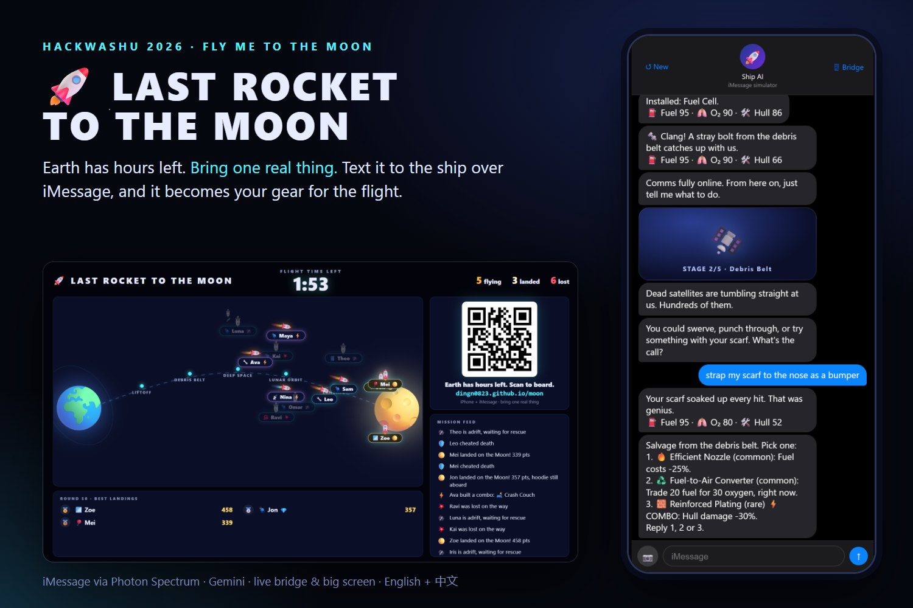
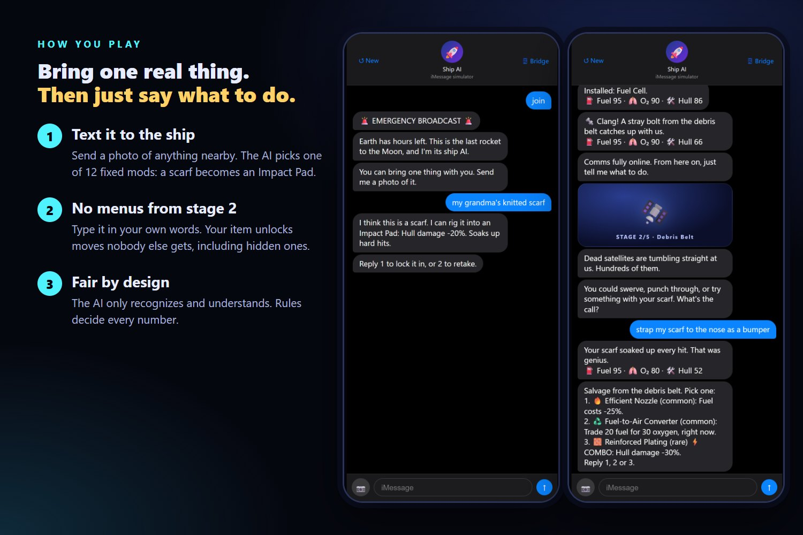

# Last Rocket to the Moon

HackWashU 2026 · theme "Fly Me to the Moon" · Photon Bonus Track

Earth has hours left. You can bring **one thing** with you. Snap a photo of whatever is next to you, and the ship AI rigs it into gear for the trip. It changes which moves you can make over 5 stages from Earth to the Moon, and the ending remembers whether it survived.

**Play:** https://dingn0823.github.io/moon (live while our laptop is running at the event). You'll need an iPhone with iMessage. The first text picks the language: "join" for English, "加入" for Chinese.



## How you play

1. **Join.** Open the link above, type a nickname and your iPhone number, and scan the QR code. Messages opens with your join code ready, so you just tap send. The laptop page turns into your personal bridge.
2. **Bring one real thing.** Send the ship a photo of anything nearby. Gemini picks one of 12 fixed modifications for it: a scarf becomes an Impact Pad, a Coke can a Fuel Side Pod.
3. **Fly 5 stages.** Stage 1 and the upgrade picks are numbered. From stage 2 on, just say what you'd do in your own words. Your item unlocks moves other players don't get, including hidden ones.
4. **Land (or don't).** Touchdown, adrift or lost. The ending says whether your item made it, and a captain's log is written for your run.

At events, the big screen puts everyone on the same launch: a boarding countdown, 3·2·1 liftoff, a 5-minute flight with a live mission feed, then a podium.



## Run it

Needs Node ≥ 23.6 (it runs `.ts` directly) or Bun.

```bash
npm install
npm start          # or: bun src/main.ts
```

On Windows you can also double-click **Start game.cmd** (game server, opens the host console) or **Rehearse big screen.cmd** (big screen with bot players on :3100).

- http://localhost:3000 is the landing page
- http://localhost:3000/host is the host console (only opens on the laptop running the server)
- http://localhost:3000/phone is the iMessage simulator (stand-in for the Photon channel)
- http://localhost:3000/screen is the big screen
- **🖥 Bridge** in the simulator header opens the live bridge view for that run

### With your own Photon account (real iMessage)

1. Create a project on the [Photon dashboard](https://app.photon.codes) and put its `PROJECT_ID` and `PROJECT_SECRET` in `.env` (or run `npx @photon-ai/cli projects secret --project <id> --json`).
2. Run `npx @photon-ai/cli login` once. The join page uses that login to register players with your project automatically.
3. `npm start` connects to Photon and opens a public URL with a Cloudflare quick tunnel (put `cloudflared.exe` in `tools/`, or set `PUBLIC_URL`).

Registered players text the number Photon assigned them; you can list them with `npx @photon-ai/cli spectrum users list`.

Also optional in `.env`: `GEMINI_API_KEY` enables photo recognition, free-text parsing and ending narration. Without it, the game still plays end to end: typed item descriptions and photo captions are matched by keywords, and unclear replies fall back to numbered options.

```bash
npm test           # engine, input parsing, dedupe, rounds, big screen
npm run simulate   # balance table: landing rate per starting item and player style
npm run typecheck
```

## Scoring

The score rewards playing well, not fast. Only landings make the big-screen leaderboard.

| | Points |
|---|---|
| Ending | touchdown 200 · adrift 80 · lost 0 |
| What's left | fuel + oxygen + hull, each 0–100 (not counted if the ship is lost) |
| Combos | +40 each |
| Your item | +60 if it made it (you didn't tear it apart in lunar orbit) |

In the demo video: 200 + (20 + 92 + 89) + 40 + 60 = **501**. The weights live in `content/endings.json`.

## How it works

```
channel (sim | Photon iMessage) → GameService (per-player serial queue, dedupe, AI fallback chain)
                                → engine.step(state, input) → save → send to phone → long-poll to bridge & big screen
```

- `src/engine/`: pure state machine. All numbers, rarity and resolution live here; no I/O.
- `src/ai/`: Gemini with hard timeouts. It can only choose from fixed lists, and every output is validated.
- `src/channel/`: the Photon Spectrum iMessage channel, the browser simulator, and automatic player registration.
- `src/server/`: web pages, long polling, the Cloudflare tunnel and the GitHub Pages short link.
- `content/*.json`: every event, item, upgrade, combo, ending and line of copy, in English with a Chinese overlay.
- Input understanding: number → keywords → AI → clarify once → numbered options.

## Credits

Built during HackWashU 2026 (Sep 25–27). Photon Spectrum for iMessage, Google Gemini API, Cloudflare Tunnel and GitHub Pages; libraries spectrum-ts, qrcode, heic-decode and jpeg-js. Icons are system emoji. Written with Claude Code as an AI pair programmer.
